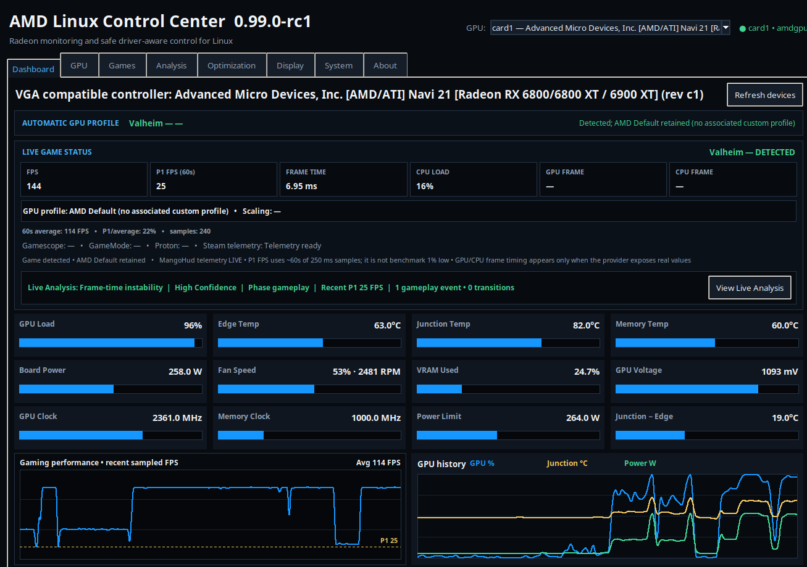
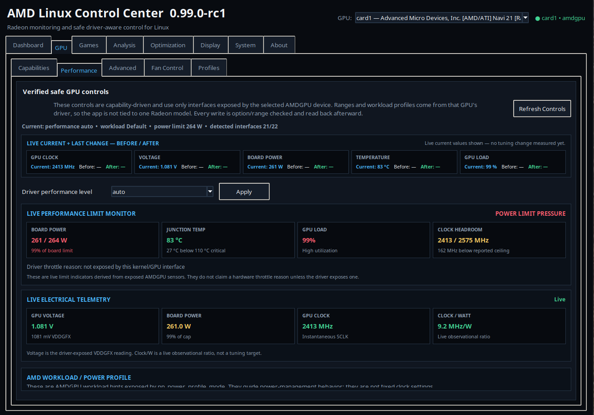
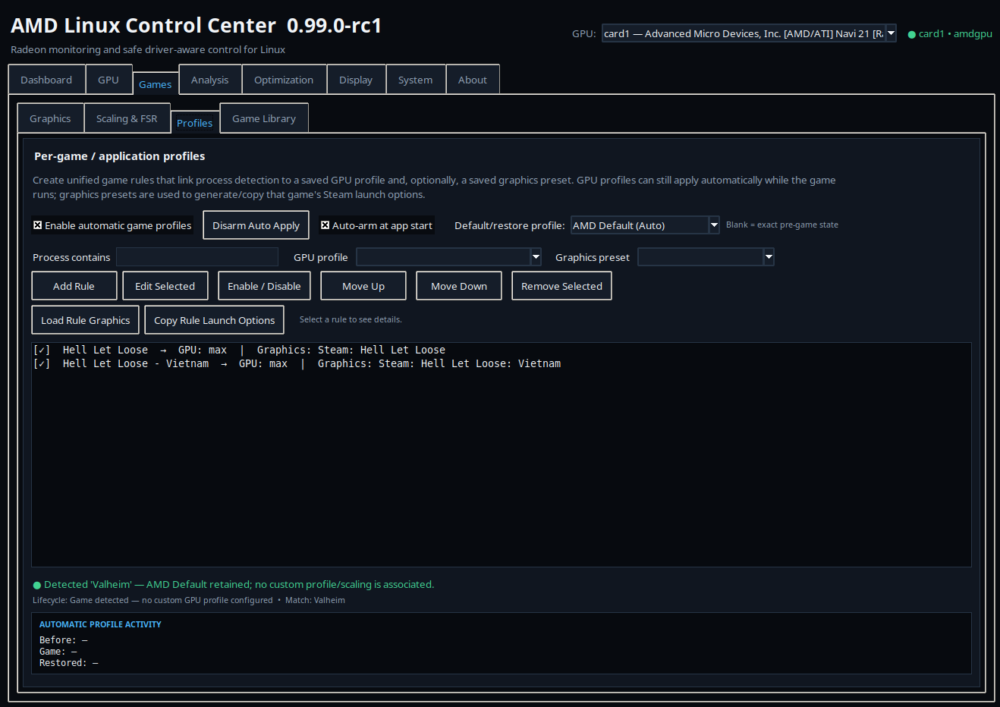
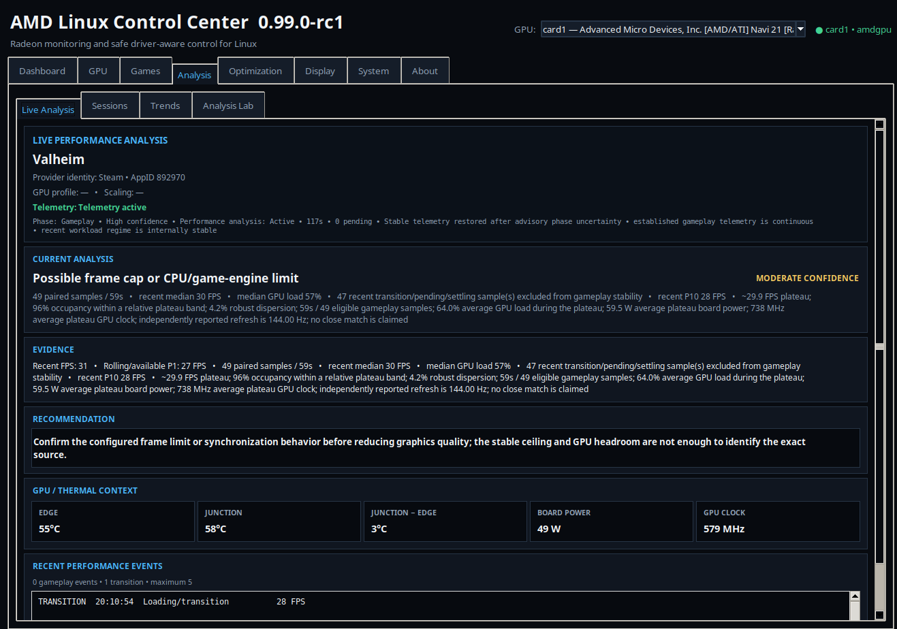
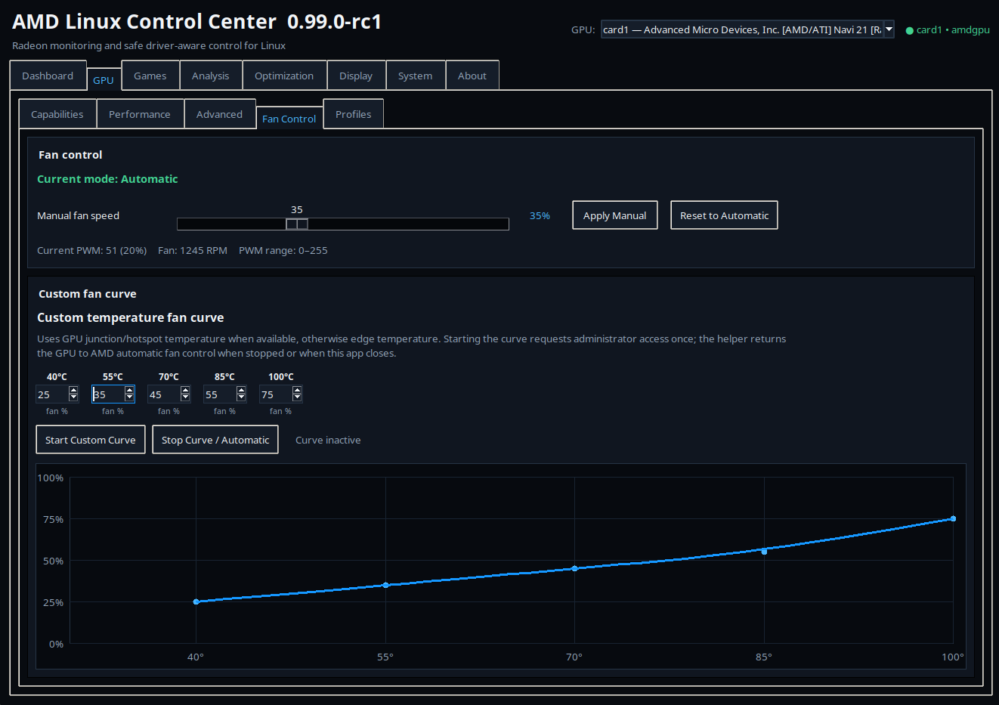
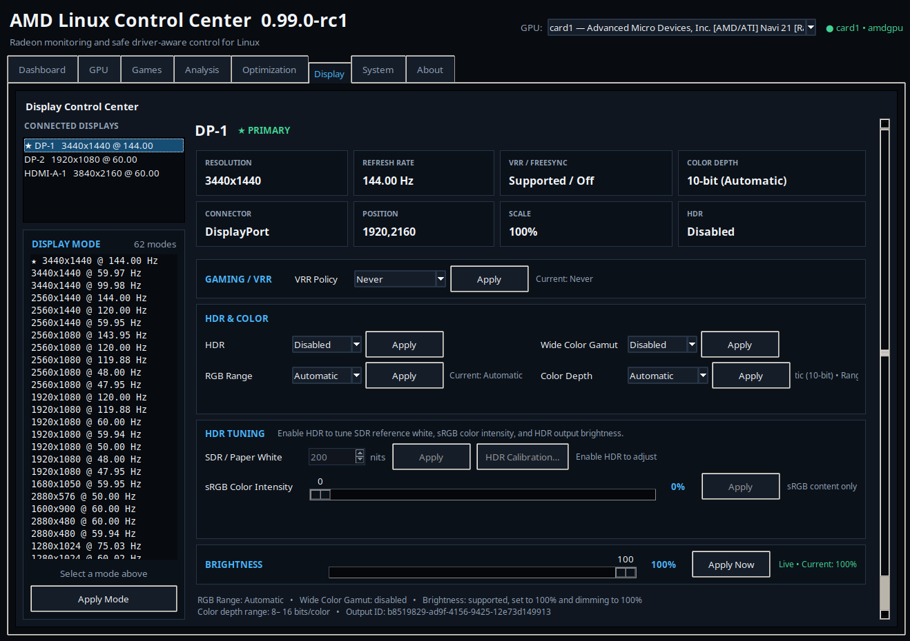

# AMD Linux Control Center

AMD Linux Control Center (ALCC) is a capability-driven control and telemetry application for AMD GPUs on Linux. It is designed to expose only the controls supported by the detected hardware and driver rather than assuming a specific GPU model.

> **Current status:** `v0.99.0-rc2` — second release candidate for 1.0. RC2 focuses on hardware feedback, fan-control usability, atomic-host setup, and release polish found during RC1 testing.

## Live gaming dashboard



Automatic game detection, live FPS and frame-time telemetry, GPU sensors, thermal monitoring, board power, clock behavior, fan speed, junction-to-edge delta, and recent performance history in one view.

## Features

- AMD GPU detection and capability-based controls
- GPU profiles and saved settings
- Per-game profile automation
- Live telemetry and session history
- Performance analysis and recommendations
- Steam/game discovery and launch integration
- Gamescope/FSR integration where supported
- Display selection and related gaming/display controls
- Multi-distro installer and runtime checks
- Narrowly scoped PolicyKit authorization for supported GPU controls

## Screenshots

### GPU performance controls



Capability-driven GPU controls with live readback, performance-limit monitoring, workload/profile handling, electrical telemetry, and driver-exposed limits.

### Per-game profiles



Automatic per-game rules can link detected processes to saved GPU profiles and graphics/scaling presets, with restore behavior when the game exits.

### Live performance analysis



Live analysis combines game telemetry with GPU load, power, clocks, thermal context, and recent events to identify likely performance limits and provide evidence-backed recommendations.

### Custom fan control



Manual fan control and custom temperature-based fan curves use junction/hotspot temperature when available, with fallback to edge temperature on hardware that does not expose junction temperature.

### Display controls



Connected-display selection and controls for resolution, refresh rate, VRR/FreeSync policy, HDR, color depth, RGB range, wide color gamut, and brightness where supported.

## Tested distributions

The release-candidate series has been exercised on:

- Ubuntu 26.04.1 LTS
- Bazzite
- CachyOS
- Fedora Linux 44 KDE
- Linux Mint 22.3
- Debian 13 (Trixie)
- openSUSE Tumbleweed

Hardware and distro support is capability-driven, so controls can vary by GPU, kernel, driver, desktop environment, and distribution.

## Install

Download and extract the current release candidate, then run:

```bash
cd amd-linux-control-center-0.99.0-rc2
./install.sh
```

You can check the system first without installing:

```bash
./install.sh --check-system
```

To install missing runtime prerequisites automatically on supported mutable distributions:

```bash
./install.sh --install-dependencies
```

### Bazzite / rpm-ostree systems

ALCC does **not** automatically layer host packages on atomic/rpm-ostree systems. Run the system check first and follow the command it prints for any missing prerequisite.

A common fresh-Bazzite case is missing Python Tkinter. If the system check reports `Tkinter: MISSING`, use:

```bash
sudo rpm-ostree install python3-tkinter
systemctl reboot
```

After the reboot, return to the extracted ALCC folder and run:

```bash
./install.sh --check-system
./install.sh
```

The first command should report `Runtime prerequisites: READY` before you continue with installation. If another prerequisite is missing, use the exact rpm-ostree command shown by the checker and reboot into the new deployment before retrying.

After installation, launch with:

```bash
~/.local/bin/amd-linux-control-center
```

## RC2 testing request

Please try the application normally before reading detailed documentation. We want feedback on both **functionality** and **usability**.

In particular, report:

- GPU model and Linux distribution
- Desktop environment / display server if relevant
- Whether installation and GPU detection worked
- Controls that were unavailable or behaved unexpectedly
- Profile, fan, telemetry, Steam, Gamescope, FSR, or display issues
- Anything that was unclear or not intuitive
- Any control you were hesitant to use because its effect was not obvious

When reporting a problem, include terminal/error output and the steps that led to it when possible.

## Release-candidate policy

`v0.99.0-rc2` remains feature-frozen for 1.0. Changes are intended to be limited to confirmed bugs, regressions, compatibility fixes, and justified usability improvements found during RC testing.

## Optional tray support

System-tray support uses Pillow/pystray when available. The main application can still run without those optional packages.

## Project status

The goal of this RC cycle is to validate hardware diversity and first-time-user experience before publishing `v1.0.0`.
